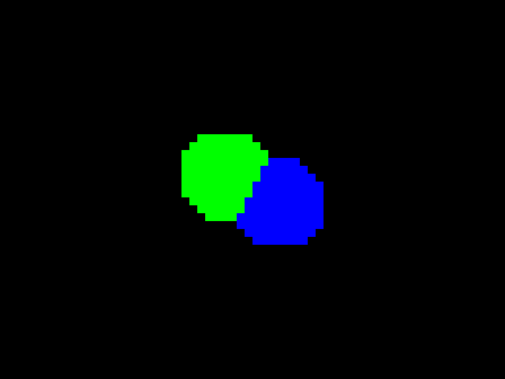

|   |   |
|---|---|
| | |
| | |

## What's this?

The end goal is to take a 3D model of a teapot as input, and produce a 2D picture of a teapot as output. The 3D model is essentially a [collection of points](https://graphics.stanford.edu/courses/cs148-10-summer/as3/code/as3/teapot.obj) on the teapot's surface. The [output image](https://user-images.githubusercontent.com/1711539/194287665-05583649-dcb0-4014-82b9-424f945e19a4.png) is a 2D grid of pixels, each having a color value.

The idea is that when we look at an object, our eye detects rays of light bouncing off the object. Some rays hit our eye towards the left-hand side of the detection zone; some hit the lower-right-hand side; etc, etc. And we're able to "understand" this flood of rays as a 2D image, and "see" it in our mind. Or something like that.

This program works similarly to the above description. Each pixel in the output image corresponds to a tiny part of the eye (the images above have 64x48 pixels, so we're modelling the eye as having 64x48=3072 "parts"). Each pixel (part) is assigned a color value, based on the color and amount of light hitting it.

As you can see above, we haven't rendered a teapot yet, but it's been fun regardless! I've been following matklad's [Ray Tracer Construction Kit](https://matklad.github.io/2022/12/31/raytracer-construction-kit.html), which I highly recommend.
